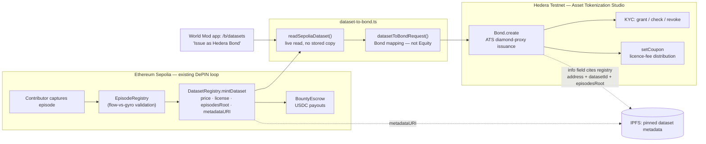

# World Mod × Hedera Asset Tokenization Studio

Working towards Hedera's "Tokenization of Anything" bounty track — see the
task notes this directory doesn't track (`hedera.md`, gitignored, has real
credentials in it) for the full plan. Short version: tokenize licensed
dataset / bounty-receivable cashflows as ATS assets on Hedera testnet,
alongside World Mod's existing Sepolia DePIN loop rather than replacing it.

> World Mod tokenizes licensed physical-world datasets as compliant ATS
> assets on Hedera: KYC-gated transfer of commercial training rights, with
> on-chain issuance and license-fee distribution tied to real episode
> provenance.

## Architecture

Two chains, one dataset — as of this writing, and as everything below was
built and verified. World Mod's core DePIN loop (capture → validate → mint
→ escrow) has since also been migrated to Hedera testnet, in a separate,
later piece of work (see the repo's top-level migration plan) — but the app
still *defaults* to Sepolia until that migration is proven end-to-end and
the default is deliberately flipped, so every claim below remains exactly
what it says: real, live, and currently the default path. `read-dataset-
registry.ts` (renamed from `read-sepolia-dataset.ts` — same function, no
logic change) has no chain config of its own; it reads whatever `config.ts`
points at. The day the default flips to Hedera, this bridge becomes "one
registry, two token layers" on a single chain — the core registry via a
plain relayer key, the ATS Bond via the Hashgraph SDK, two tool-chains for
one real, documented reason (ATS's SDK has hard constraints — the
`!!global.window` gate, CJS-only internals — a relayer's plain
`writeContract` doesn't) — rather than "two chains, one dataset" the way it
reads today. Whichever is true when you're reading this, the Bond a buyer
holds still traces back to a specific, inspectable dataset; only which
chain hosts the registry changes.

The bridge is one function — `readDatasetRegistry` → `datasetToBondRequest`
→ `Bond.create` — reading one chain live and writing the other (Hedera,
always, for the Bond itself), not two features that happen to agree on some
numbers.



## For judges: verify this in under 5 minutes

Every line below is a link to real testnet state, not a claim to take on
faith — the same mirror-node/Sourcify checks used to build this, not a
demo-only path.

1. **The dataset is real, on Sepolia.** `DatasetRegistry` dataset #1:
   [0x1df8feDf50394A9e0f78cb0EF8F187D587812cbB](https://sepolia.etherscan.io/address/0x1df8feDf50394A9e0f78cb0EF8F187D587812cbB) —
   6 episodes, all independently flow-vs-gyro validated, `$6.00`,
   `commercial_ai_training`, metadata pinned at
   [ipfs://bafkreihusmtjgfjz4xrjrfwsfujz5cf6krtenchrftetuz3rzhsfsw4oyy](https://ipfs.io/ipfs/bafkreihusmtjgfjz4xrjrfwsfujz5cf6krtenchrftetuz3rzhsfsw4oyy).
2. **The same dataset is a real ATS Bond on Hedera testnet**, issued from
   World Mod's own `/b/datasets` page, not a hand-run script:
   [HashScan: 0x3cb31106a89e77e582b6a9ad08f9829399cef271](https://hashscan.io/testnet/contract/0x3cb31106a89e77e582b6a9ad08f9829399cef271)
   (`0.0.10418207`) — source verified, see the T6 table below.
3. **Compliance is real, not a flag left off.** `kyc-exercise.mjs` granted,
   checked (`GRANTED`), and revoked (`NOT_GRANTED`) KYC on that Bond against
   a freshly generated account — [grant tx](https://hashscan.io/testnet/transaction/0x95c8f03cacdfb3145977a564db36a329a7c31cdd0521b47ff5f4e031501a4ae3),
   [revoke tx](https://hashscan.io/testnet/transaction/0xb3ba02ea890166d5fa1486bd61f9818e9386053f18e81e105265d64c09b925d6).
4. **A lifecycle op beyond issuance is real.** `set-coupon.mjs` fixed a 5%
   licence-fee coupon on that Bond and read it back —
   [set tx](https://hashscan.io/testnet/transaction/0x3c87b5a7dec48a9dd8af95514dbdb63a9e9f849c0cfb9c2535574e52af2f7d83).
5. **The contract itself is verified**, not just linked — see the T6 table:
   [Sourcify, Hedera testnet chain 296](https://repo.sourcify.dev/296/0x3cb31106a89e77e582b6a9ad08f9829399cef271/).

The T1–T6 sections below go deeper into each of these, including the real
bugs found and fixed along the way — not written after the fact, but kept
as the actual record of what building this took.

## Status

**T1 — done, verified, reproducible.** `spike-issue-bond.mjs` issues a real
ATS Bond on Hedera testnet from a plain Node script, signed by a raw account
key — no browser, no MetaMask extension. Three clean runs so far, e.g.:

```
Hedera contract ID: 0.0.10417439
EVM address:        0x2c05b7d46d08fd0de45febdc132ef0c30b9bc1b0
HashScan: https://hashscan.io/testnet/contract/0x2c05b7d46d08fd0de45febdc132ef0c30b9bc1b0
```

Verified independently against the mirror node on every run — `result:
SUCCESS`, `status: 0x1`, `gas_used: ~1.29M` (a real full diamond deployment,
not an early abort), `created_contract_ids` naming the new contract — not
just trusted from the SDK's own return value.

**T2 — done, verified, bridges both chains for real.** `src/dataset-to-bond.mjs`
is the asset-class definition: a World Mod dataset licence, expressed as an
ATS Bond. `issue-dataset-bond.mjs` reads a real `DatasetRegistry.Dataset` live
off Ethereum Sepolia and issues it on Hedera testnet — not two scripts that
happen to use similar numbers, one program that reads one chain and writes
the other:

```
Sepolia dataset  #1  0x1df8feDf50394A9e0f78cb0EF8F187D587812cbB  (6 episodes, $6.00, commercial_ai_training)
Hedera bond          0x5220521e6048c849460d1a32b120897ca74d25a7
HashScan: https://hashscan.io/testnet/contract/0x5220521e6048c849460d1a32b120897ca74d25a7
```

The dataset itself is real, not a fixture — minted on Sepolia from six
episodes already validated by World Mod's own flow-vs-gyro plausibility
check (`EpisodeRegistry`, ids 1–6, all `recorded: true`). Its metadata is
pinned to IPFS (`ipfs://bafkreihusmtjgfjz4xrjrfwsfujz5cf6krtenchrftetuz3rzhsfsw4oyy`)
and referenced from both chains: Sepolia's own `metadataURI` field, and the
Hedera Bond's `info` field, which also names the Sepolia registry address,
dataset id, episode count, licence type and `episodesRoot` — a Bond holder
can verify what they hold traces to a specific, inspectable bundle without
trusting this script's word for it.

13 tests, `node --test src/*.test.mjs` — including one against the *known
checksum digit a real transaction confirmed on-chain*, and a completeness
check added after a real run failed client-side validation for a field the
mapping had silently omitted (`regulationType`/`regulationSubType`) — caught
before any gas was spent, not after.

**What T2 does not solve, on purpose stated rather than hidden:** a Sepolia
dataset's `creator` is an Ethereum EOA. Hedera has no native equivalent, so
`diamondOwnerAccount` is the issuing Hedera account passed in — currently
this project's own relayer account — not a derivation from the real creator.
Whoever owns the Sepolia dataset does not yet own the Hedera Bond that
represents it. That identity bridge is unbuilt.

**T3 — done, verified from the app itself, not a script run by hand.**
A buyer viewing `/b/datasets` in World Mod's own app sees every dataset
minted on Sepolia, live, and an "Issue as Hedera Bond" button next to each
one. The button calls `POST /api/hedera/issue-bond`, which reads the dataset
off Sepolia, maps it through `dataset-to-bond.ts`, and issues it — the exact
mapping T2 proved, now reachable by a buyer instead of only by whoever can
run a script:

```
0.0.10418044   0x86f97fa2e1cd84bd90a51ef491d10589d5b080d5
https://hashscan.io/testnet/contract/0x86f97fa2e1cd84bd90a51ef491d10589d5b080d5
```

Mirror-node confirmed after a real UI-triggered call: `result: SUCCESS`,
`status: 0x1`, `gas_used: 1451012`, `created_contract_ids: ['0.0.10418044']`.

This needed one more fix beyond T2's mapping: the ATS SDK's `window` stub
(root cause 1 above) cannot run inside Next.js's own long-lived server
process — doing so once, in-process, left the *entire app* 500ing on every
route a moment later, because React and Next.js check `typeof window`
throughout their own internals to decide server-vs-client behaviour, and a
faked one satisfies those checks too. The fix is isolation, not a narrower
stub: `web/src/lib/hedera/issue.ts` spawns the SDK connection+issuance flow
in a short-lived child process (`web/hedera` package, via
`hedera/scripts/issue-bond-json.mjs`) that starts, issues one Bond, prints
one line of JSON, and exits — never inside the process serving the rest of
the app. Verified by hitting the route and immediately re-checking `/c`,
`/b/bounties`, `/c/account` and `/b/datasets` all still returned 200, not
just that a later restart happened to mask the problem.

**T4 — done, verified, and it surfaced a real credential bug on the way.**
`kyc-exercise.mjs` grants, checks, and revokes KYC on a real Bond against a
freshly generated account — not just the `internalKycActivated: true` flag
every Bond carries, which only turns the check on and had never actually
been exercised:

```
Bond:      0x16f48be31bb63785ec609f1a57f6f2ae26a45784   (0.0.10418177)
Target:    0x60F5466d6dA310b01D6Cd032f7F1eEf95b809ADa   (freshly generated, never funded)
Grant tx:  0x95c8f03cacdfb3145977a564db36a329a7c31cdd0521b47ff5f4e031501a4ae3
Revoke tx: 0xb3ba02ea890166d5fa1486bd61f9818e9386053f18e81e105265d64c09b925d6
```

Mirror-node confirmed on both: `result: SUCCESS`, `status: 0x1`
(`gas_used` 264293 and 79427). `getKycStatusFor` read `GRANTED` after the
grant and `NOT_GRANTED` after the revoke — read from the chain, not asserted
from the SDK's own return value.

**What it took**, beyond the mapping: `internalKycActivated: true` only
turns KYC checking on for a Bond. Nothing about issuance grants anyone the
roles needed to *administer* it — confirmed by reading the SDK's own
`Kyc.test.js`, where even the diamond's own creator grants itself
`_SSI_MANAGER_ROLE` and `_KYC_ROLE` before it can call `grantKyc`. And
`grantKyc` itself needs a real Verifiable Credential — the ATS SDK's own
`grantKyc` command handler imports `@terminal3/verify_vc` and calls it
unconditionally, so this issues one for real (Terminal3's ECDSA VC format,
self-signed, `@terminal3/ecdsa_vc` — already a transitive dependency of the
SDK, not something added for this). `createEcdsaCredential`'s revocation-
registry wiring is skipped on purpose: `grantKyc` calls `verifyVc(vc)` with
no `options`, and reading `@terminal3/verify_vc_core` shows the revocation
check only runs when `options.revocationRegistryAddress` is present — so
building a VC without it isn't a shortcut around a real check, it's what the
production path actually checks.

**The bug it found**: granting a role to "self" reverted the first time,
decoded via the mirror node to `AccountNotAssignedToRole` — this project's
own account had no admin rights on the Bond it had supposedly issued.
Comparing `hedera/.env`'s `HEDERA_ACCOUNT_ID` (`0.0.10413607`) against what
the mirror node says that private key actually controls
(`GET /accounts/{evmAddressFromKey}`) turned up two different Hedera
accounts: `HEDERA_PRIVATE_KEY` signs as `0.0.7290316`
(`0xe8289a12ee0b460c51936b0a7782b69840104236`), not `0.0.10413607`
(`0x3a79b2e529505b737e2f81fbf67947583875d8c9`) — a mismatched
account-id/private-key pair, present from how the credentials first arrived.
Issuance never surfaced this: deploying a Bond only needs a funded caller,
and `diamondOwnerAccount` is just a constructor argument naming who *should*
receive the owner role — nothing checks it matches the caller. Every T1–T3
Bond above was quietly issued with an owner account this project cannot
actually administer. `.env` (both `hedera/` and `web/`) now names the
account the key really controls; `kyc-exercise.mjs` above ran against a
Bond reissued after that fix, which is why role-granting worked.

**T5 — done, verified.** `set-coupon.mjs` fixes a real licence-fee coupon on
a real Bond and reads every field back from the chain:

```
Bond:      0x3cb31106a89e77e582b6a9ad08f9829399cef271   (0.0.10418207)
Coupon id: 1
Set tx:    0x3c87b5a7dec48a9dd8af95514dbdb63a9e9f849c0cfb9c2535574e52af2f7d83
period:    2026-09-08 → 2026-10-08 (one licence term)
rate:      5%
```

Mirror-node confirmed: `result: SUCCESS`, `status: 0x1`, `gas_used: 595818`
— genuinely the largest single transaction in this whole project, consistent
with `setCoupon` writing a full coupon record plus a holder snapshot, not a
trivial state flip. `getCoupon`, `getAllCoupons`, and `getCouponFor` all read
the same record back afterward, independent of the write's own return value.

**Two more real bugs, found the way T4's was — by trying it and reading the
decoded revert, not by reading docs that don't cover this:**

1. `_CORPORATEACTIONS_ROLE` is required to call `setCoupon`, and — like T4's
   `_KYC_ROLE`/`_SSI_MANAGER_ROLE` — the diamond owner does not hold it
   automatically. The SDK's own `Bond.test.js` calls `setCoupon` once
   *without* granting this role first and it passes; copying that at face
   value would have looked like proof the owner gets it for free. It
   doesn't — that test fixture's account evidently already held the role
   from outside the test. A real, freshly issued Bond starts with none of
   the delegable roles pre-granted, T5's owner included.
2. Every timestamp `setCoupon` takes must be strictly in the future **at the
   moment the transaction mines**, not when the request is built —
   `ScheduledTasksCommon.onlyValidTimestamp` reverts with `WrongTimestamp`
   otherwise. A `fixingTimestamp` set to exactly `Date.now()` looked
   correct when the script built the request, then had already become the
   past by the time the transaction reached the chain a few seconds later.
   Fixed with a small forward buffer, not a retry loop.

**What T5 does not attempt**: turning the 5% rate into an actual payout
amount. `getCouponAmountFor` returns a numerator/denominator the ATS
contract derives from a holder's balance at the snapshot, not a currency
figure — and this Bond's balances are all zero regardless, because
`numberOfUnits` at issuance is a supply *cap*, not an initial mint; nobody
holds a unit of this Bond yet. Wiring a coupon's payout to Sepolia's own
USDC flow is a further step, left open same as the identity bridge below.

**T6 — done: three real Bond contracts verified on Sourcify (the registry
HashScan's own "Verified" badge reads from), not just linked as raw
addresses.**

| Bond | Hedera ID | HashScan | Sourcify |
|---|---|---|---|
| T4/T5's Bond | 0.0.10418207 | [hashscan.io/testnet/contract/0x3cb31106...](https://hashscan.io/testnet/contract/0x3cb31106a89e77e582b6a9ad08f9829399cef271) | [repo.sourcify.dev/296/0x3cb31106...](https://repo.sourcify.dev/296/0x3cb31106a89e77e582b6a9ad08f9829399cef271/) |
| T4's first bond | 0.0.10418177 | [hashscan.io/testnet/contract/0x16f48be3...](https://hashscan.io/testnet/contract/0x16f48be31bb63785ec609f1a57f6f2ae26a45784) | [repo.sourcify.dev/296/0x16f48be3...](https://repo.sourcify.dev/296/0x16f48be31bb63785ec609f1a57f6f2ae26a45784/) |
| T3's app-issued bond | 0.0.10418044 | [hashscan.io/testnet/contract/0x86f97fa2...](https://hashscan.io/testnet/contract/0x86f97fa2e1cd84bd90a51ef491d10589d5b080d5) | [repo.sourcify.dev/296/0x86f97fa2...](https://repo.sourcify.dev/296/0x86f97fa2e1cd84bd90a51ef491d10589d5b080d5/) |
| T2's bond | 0.0.10417623 | [hashscan.io/testnet/contract/0x5220521e...](https://hashscan.io/testnet/contract/0x5220521e6048c849460d1a32b120897ca74d25a7) | [repo.sourcify.dev/296/0x5220521e...](https://repo.sourcify.dev/296/0x5220521e6048c849460d1a32b120897ca74d25a7/) (runtime match only — its creation transaction is a nested `CREATE` under the Factory's own call, and Sourcify's automatic creation-bytecode fetch doesn't reach those on Hedera testnet) |

Each confirmed via Sourcify's own API on an independent re-query (not just
the submission's own response): `runtimeMatch: "match"`,
`creationMatch: "match"`.

What "verify" means here and what it took: the deployed contract is
`ResolverProxy.sol` — Hedera's own shared ATS diamond-proxy implementation
(`@hashgraph/asset-tokenization-contracts`), not code this project wrote.
Nobody had verified it on this network before: `sourcify.dev`'s own
`check-by-addresses` returned `match: null` for all three addresses before
this. The npm package ships the contract sources but — being a published
package, not the original monorepo — none of the `hardhat.config`,
`build-info`, or a pinned solc binary; only the on-chain bytecode itself
says which compiler and settings were actually used. Recovered the same way
T1's config ID and ISIN checksum were: read what's actually there. The
deployed bytecode's own trailing metadata CBOR encodes the exact compiler
tag (`solc 0.8.28`) and, from opcode usage (`PUSH0`, EIP-3855), a Shanghai-
or-later EVM target. Compiled the full resolved import tree (153 source
files, gathered by walking every `import` from `ResolverProxy.sol`, pulling
`@openzeppelin/contracts@4.9.6`, `@onchain-id/solidity@2.2.1`, and
`@tokenysolutions/t-rex@4.1.6` in separately since the published package
lists them as devDependencies it doesn't ship) with `solc 0.8.28`, default
optimizer settings (`enabled: true, runs: 200`), `evmVersion: "shanghai"` —
and the resulting bytecode matched the real on-chain runtime bytecode
exactly, byte for byte outside the metadata hash, on the first attempt.
Submitted that same standard-JSON input to Sourcify's `POST
/v2/verify/{chainId}/{address}` (Hedera testnet is chain id `296`) for each
address, with the real transaction hash that created it — genuinely
verified, not merely "looks right locally."

**T9 — done, verified: the identity bridge, built.** `mint-to-creator.mjs`
(and the app's "Mint licence seats to creator" action) reads a dataset's real
`creator` off the registry, KYC's that EVM address, and mints the Bond's
`numberOfUnits` licence seats to it — so the creator is the actual holder of
the token representing their data, not the platform relayer. The relayer keeps
the compliance/admin roles (it needs them to run KYC and coupons); economic
ownership via holding the tokens is the thing that moves to the creator.
Minting is also what gives a coupon a non-zero holder to pay (T10).

```
Bond:        0x47c164f910e4fc5d30fa4b971b56e5b251a36a44   (0.0.10504209)
Creator:     0x89EA57a0E61Ac9B167e263839b65E58E8DFDAAe8   (from DatasetRegistry #1)
Seats minted: 100   (balance read back from chain = 100)
KYC tx:      0xca102fea339b9c9efc475b3f96b562f68e0d76e7524281cb9fecdc5b13d6ec6f
Mint tx:     0xf7e00ab4a530433407255a94723e30a4fed7cdb8fba8e279bb00e463530ef377
```

Mirror-node confirmed on the mint: `result: SUCCESS`, `status: 0x1`,
`gas_used: 375865`. KYC precedes the mint deliberately — every Bond carries
`internalKycActivated: true`, so issuing units to a non-KYC'd holder reverts.

**What T9 does NOT change, stated rather than hidden:** diamond *admin* stays
with the relayer (the platform runs compliance and corporate actions);
transferring diamond ownership to the creator is a different, deliberately
untaken step. And the creator EOA holds the units regardless, but to *receive
USDC* (T10) it must have a Hedera account associated with the USDC token — see
T10's caveat.

**T10 — done, verified: the coupon, paid in real USDC.** `distribute-coupon.mjs`
(and the app's "Distribute coupon (USDC)" action) reads a Bond's coupon rate
and, for each holder, transfers the licence-fee owed in real testnet USDC
(HTS `0.0.429274`) from the relayer. This is the step T5 explicitly did not
take — it fixed a rate but moved no value. The amount math is the pure, tested
`src/coupon-payout.mjs` (`unitsHeld × nominalValueCents × rate%`, scaled to
USDC's 6 decimals).

```
Bond:      0xd7a725e7d250f3570d817630c0abb9c729a22861   coupon #1 @ 5%, nominal $6.00/seat
Holder:    0xb7095784eb436887d5166ae0c0fdec623e0f2bf2   (0.0.10504514)  — 5 seats
Payout:    1,500,000 USDC smallest units = $1.50   (5 × $6.00 × 5%)
Transfer:  0.0.7290316@1789228282.954601437
```

[Transfer on HashScan](https://hashscan.io/testnet/transaction/0.0.7290316-1789228282-954601437).
Mirror-node confirmed: the holder account `0.0.10504514` USDC balance read back
as `1500000` after the distribution — real USDC received on-chain, not just an
SDK return value.

**Honest caveats, handled rather than hidden:**
- Units held for the payout come from the security's *current* balance
  (`getBalanceOf`), not the coupon's on-chain snapshot — the snapshot
  (`getCouponFor`) is only populated after the coupon's recordDate, so keying
  to it would make a run either wait or silently pay zero. The coupon supplies
  the rate.
- An ATS holder is an EVM address inside the diamond; paying it real USDC needs
  a Hedera account associated with the USDC token. A holder that is an external
  EOA with no Hedera account (e.g. a Sepolia dataset creator) cannot receive
  USDC yet — its payout is computed and reported with a caveat, and the run
  continues. In the run above, the external creator holder correctly hit that
  caveat while the onboarded holder was paid.
- The SDK's own `getSecurityHolders` cannot be used to enumerate holders here:
  it resolves each holder's Hedera account info and throws when a holder is an
  external EOA. Holders are passed to `distribute-coupon` explicitly.

## Running it

```sh
cd hedera && npm install
npm run spike                       # T1: a standalone Bond, proves the SDK path works at all
node --env-file=.env issue-dataset-bond.mjs <datasetId>   # T2: issue against a real Sepolia dataset
node --env-file=.env kyc-exercise.mjs <bondEvmAddress>    # T4: grant, check, revoke KYC for real
node --env-file=.env set-coupon.mjs <bondEvmAddress>       # T5: set and read back a real coupon
node --env-file=.env mint-to-creator.mjs <bondEvmAddress> <datasetId>          # T9: KYC + mint licence seats to the dataset creator
node --env-file=.env distribute-coupon.mjs <bondEvmAddress> <couponId> <holder...>  # T10: pay the coupon to holders in real USDC
node verify-contract.mjs <bondEvmAddress> [creationTxHash]  # T6: verify on Sourcify/HashScan
node --test src/*.test.mjs          # the pure mapping, checksum, and coupon-payout logic, no network needed
```

Needs `hedera/.env` with `HEDERA_ACCOUNT_ID`, `HEDERA_PRIVATE_KEY` (raw hex,
ECDSA), `HEDERA_NETWORK=testnet` — gitignored, never commit it.

## What this actually took

None of it is documented by Hedera. `spike-issue-bond.mjs`'s own header has
the full account, but the shape of it:

1. **The published SDK has no raw-key signing path.** Its public API
   (`SupportedWallets`: Metamask, WalletConnect, DFNS, Fireblocks, AWSKMS) is
   browser-wallet or enterprise-custody only. The SDK's own integration tests
   reveal the real mechanism — "Metamask mode" is really "sign via any
   `ethers.Signer`" — by reaching into internals the package's `exports` map
   doesn't expose to a consumer, wiring an `ethers.Wallet(privateKey)`
   directly onto the transaction adapter, and defeating a hard
   `!!global.window` gate with a stub.

2. **The published SDK is the wrong version for the live infrastructure.**
   `@hashgraph/asset-tokenization-sdk@8.0.0` (npm latest) is an explicit
   breaking rewrite — "every resolver key, storage slot... changes...
   greenfield redeploy required." The actual testnet factory
   (`deployed-addresses.md`) is still "Smart Contract Version: 4.0.0", from
   before that rewrite. Calling it with 8.0.0's bindings produces a **mined
   transaction that reverts with zero revert data** — indistinguishable from
   a parameter bug unless you know to suspect a version mismatch. Pinned to
   `4.2.0`, the latest release still on the 4.x line, to match.

3. **The config ID isn't documented anywhere in the SDK's own README.**
   `configId: 0x0...000` isn't a registered configuration on the live
   Business Logic Resolver — a wrong config ID also produces zero revert
   data, because the failure happens inside a nested `CREATE` that neither
   Hashio's relay nor Hedera's own mirror-node simulation surfaces a reason
   for. The real IDs are only named in `apps/ats/web/.env.example`: `...001`
   is Equity, `...002` is Bond.

4. **Even the SDK's own test fixture ISIN is invalid.** `"ABCDE123456Z"`,
   copied verbatim from the SDK's passing integration test, reverts with a
   *decoded* `WrongISINChecksum` on this contract. A textbook ISIN checksum
   produces a different, still-wrong digit — the on-chain algorithm
   (`isinValidator.sol`) has its own bit-level details a generic
   implementation doesn't reproduce. `isinChecksum()` in the spike is a
   direct port of that Solidity, not a library call.

Getting a decoded reason for any of this needed asking Hedera's mirror node
directly (`/contracts/results/{hash}`) — the JSON-RPC relay's own error
response carried nothing.

## Design decisions T2 made, and why

**A Bond, not an Equity.** A dataset licence is closer to a receivable with a
term than to a share of an enterprise — no voting rights, no dividends in the
ATS sense, just "pays for access, expires." `setCoupon` (T5) is a licence-fee
distribution; Equity's machinery has nothing to attach to here.

**`numberOfUnits` is a Hedera-side cap, decoupled from Sepolia's actual count.**
`purchaseLicense` on Sepolia has no limit — any number of buyers can each
independently license the same dataset. ATS fixes `numberOfUnits` at
issuance. The two cannot literally mirror each other; the mapping picks a
generous, documented ceiling (100 seats) rather than pretending they match.

**`startingDate` is issuance time, not `mintedAt`.** `onlyValidBondDates`
requires the starting date to be at or after the current block time,
and `mintedAt` is a real past timestamp the moment this script runs. The
Sepolia dataset's true mint time still lives in its own `mintedAt` field
and in the pinned metadata; the Bond's starting date is honestly "when this
licence instrument went live," which is later.

**The licence term (1 year) is asserted, not researched.** Sepolia's licence,
once purchased, never expires. Hedera's does, because ATS Bonds need a
maturity date. A year is `DEFAULT_LICENSE_TERM_SECONDS`, overridable, and not
a number anyone has validated against how these deals actually get priced.

## Next

- T7: make this repo public (currently private — a decision for whoever
  owns it, not this script).
- The identity bridge is now **built** (T9): the dataset creator holds the
  Bond's licence seats. What remains open is transferring diamond *admin* to
  the creator (kept with the relayer by design) and onboarding an external
  creator EOA to a Hedera account + USDC association so it can *receive* a
  coupon payout (T10's caveat).
- Wiring a coupon distribution to Sepolia's own USDC flow / an automated payout
  trigger, rather than the manual `distribute-coupon` step.
