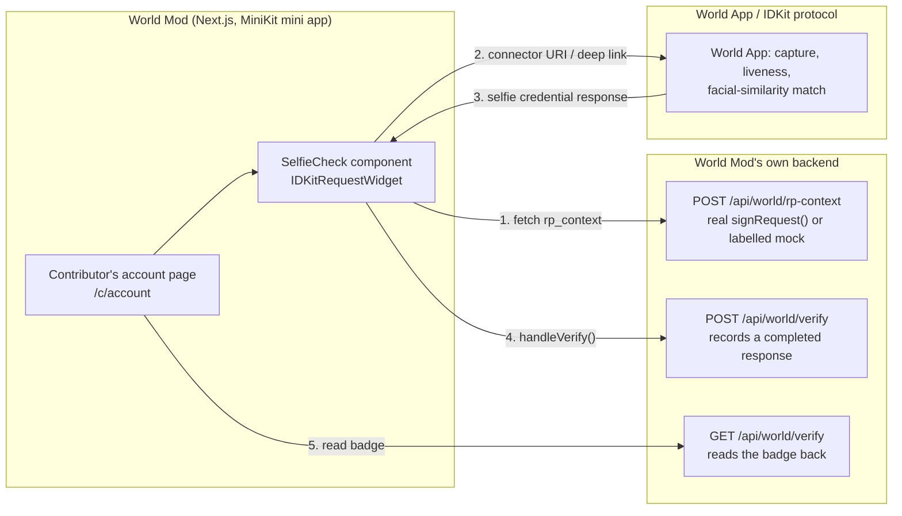

# World Mod × World App (MiniKit + Selfie Check)

Working towards World's Selfie Check track — see `world.md` (repo root) for
the qualification bar. Short version: World Mod is now a World mini app
(MiniKit provides the recoverable contributor identity, replacing Privy),
and a Selfie Check credential is a non-gating abuse-resistance/continuity
badge on a contributor's account — never a requirement to record or get
paid, matching how reputation (product-spec §12) already works.

## What's real, what's mocked, and why

**Real and working, testable right now without any World credentials:**
- The whole app runs as a MiniKit mini app (`web/src/app/minikit-client-provider.tsx`
  wraps the root layout). Outside World App, `MiniKit.isInstalled()` is
  `false` — not an error — and every route falls back to the same device-key
  identity that was always the default.
- The identity swap: Privy → World App wallet. `worldAppSigner()`
  (`web/src/lib/chain/signer.ts`) signs the exact same EIP-712 payloads
  (`RegisterEntity`, `RegisterAsset`, `SubmitEpisode`) Privy's signer did,
  through `MiniKit.signTypedData` instead of `eth_signTypedData_v4` — a
  transport swap, not a redesign. `Role`-gated capture behaviour, the
  account bar, the account page's Identity card — all rewired, typechecked,
  linted, and confirmed live (every route still 200s after the swap).
- The Selfie Check UI flow end to end: request building
  (`selfieCheckLegacy()` preset from `@worldcoin/idkit-core`), the
  `IDKitRequestWidget` modal, a server route that independently verifies a
  completed response against World's own API before recording it
  (`/api/world/verify`), and a badge that reads it back
  (`web/src/app/(contributor)/c/account/selfie-check.tsx`). Confirmed via
  direct API calls: `POST /api/world/rp-context` → `POST /api/world/verify`
  → `GET /api/world/verify?address=…` round-trips a real record through
  `web/.data/world-verifications.json` (mirrors `lib/market/store.ts`'s
  existing file-store pattern).
- **Real, independent proof verification.** `/api/world/verify` calls
  World's production verify API (`POST /api/v4/verify/{rp_id}`) and only
  records a verification when World's own servers confirm `success: true` —
  not just when IDKit's client callback says so. Confirmed genuinely live,
  not a stub: sending it a deliberately invalid nullifier got back a real,
  specific rejection from World's servers.

**Confirmed end to end, for real — not simulated, not mocked.** A Developer
Portal app (`app_d4bef1c976c0674e0583c328c02f3c10`) and RP registration
(`rp_0f7bb62abb7fba06`) exist; Selfie Check Beta access was granted for this
app; the sandbox build of World ID App was installed and used to complete a
real Selfie Check. The resulting record in
`web/.data/world-verifications.json`:

```json
{
  "0xc51a1b727e807d93d9d33ce6f1924e22ca7e735f": {
    "verifiedAt": 1788932161,
    "nullifier": "0x032fb74ce5e00502c7d6aa43f07e9e7bdf372da76b3f95a7ee8abc9913eb88a3",
    "mock": false
  }
}
```

`mock: false` is the whole story here: this only gets written after
`/api/world/verify` calls World's real `POST /api/v4/verify/{rp_id}` and gets
back `success: true` for this exact nullifier — not client-reported success
taken on faith. Every layer this README once described as "mocked" or
"not yet confirmed from a real browser" — the RP-context signing, the QR/
deep-link handoff, World ID App's own capture-and-match flow, and the
server-side verify call — is now something that has actually happened once,
against production World infrastructure in sandbox mode, not just something
that typechecks.

`rp-context.ts` still falls back to a clearly-labelled mock context whenever
`WORLD_RP_ID`/`WORLD_RP_SIGNING_KEY` are absent — that's what made it
possible to build and test everything up to this point before real
credentials existed, and it's still there for anyone cloning this repo
without their own Developer Portal app.

## Why Selfie Check fits here, specifically

World Mod pays contributors per accepted episode. The obvious abuse vector
is one person running many device identities to multiply payouts for the
same physical action — exactly what a low-friction liveness/facial-biometric
check is good at catching without requiring an Orb visit or a passport.
Framed against world.md's qualification list:

- **Abuse-prevention**: a Selfie Check badge is a real signal against
  Sybil-style bounty farming, without requiring hardware most contributors
  don't have.
- **Continuity**: because the credential is tied to World App's own
  account (not a fresh identity each install), it's the same signal on a
  replacement phone that it was on the lost one — matching exactly why
  §10.3 wanted a recoverable identity in the first place.
- **Not eligibility or fairness gating**: deliberately. §12 already commits
  to "computes and displays it but does not gate on it" for reputation; a
  Selfie Check badge follows the same rule. At this network's current size,
  gating payouts on a Beta-access-gated credential would exclude far more
  honest contributors than bad actors it would catch.

## Architecture



## Running it

```sh
cd web && npm install
npm run dev
# visit /c/account — Identity card shows "This phone only" (device key)
# outside World App; the Selfie Check card below it now requests a real,
# correctly-signed rp_context (env vars set in web/.env.local, gitignored).
```

Needs `web/.env.local`: `NEXT_PUBLIC_WORLD_APP_ID`, `WORLD_RP_ID`,
`WORLD_RP_SIGNING_KEY` — all three now set. The one thing still missing is
Selfie Check Beta access for this specific app, requested through a World
point of contact — the one step in this whole integration that is genuinely
not a coding task; see FEEDBACK.md.

## Done

- ~~Click through the actual widget from a real browser~~ — **done, for
  real.** Selfie Check Beta was granted for this app, the sandbox World ID
  App build was installed, and a real Selfie Check completed end to end:
  QR scan → World ID App capture/match → credential response →
  `/api/world/verify` independently confirmed it against World's own
  verify API → recorded (`mock: false`). Every layer this document once
  called "not yet confirmed" has now actually happened once.
- ~~Server-side proof verification~~ — **done.** `/api/world/verify` calls
  World's real verify API (`POST /api/v4/verify/{rp_id}`, found via
  `sandbox/sandbox-access` → `api-reference/developer-portal/verify.md`, not
  linked from either page this bounty task named) and confirms `success`
  before recording anything. See FEEDBACK.md for the correction to what an
  earlier draft called the biggest gap.

## Next

- Only one cell of World's own sandbox coverage matrix
  (`docs.world.org/world-id/sandbox/testing-selfie-check`) has been
  exercised (Web app, cross-device QR). Five remain:

  |  | Hot | Cold | Semi-cold |
  |---|---|---|---|
  | **Native app** | Same-device, deep link | Install → account → DOB → invite code (iOS) → enroll → check | Reinstall + recover, then check |
  | **Web app** | ✅ done | Same cold funnel, cross-device | Same recovery, cross-device |

  Native-app Hot is next in priority once this runs as a real mini app
  inside World App; Cold/Semi-cold exercise World App's own onboarding more
  than this integration, so they're lower priority. Known landmine already
  documented by World: iOS Semi-cold has no path to add an invite code if
  "Sign in" gets tapped instead of "Sign up" — expect to hit that once and
  know it's not this integration's bug.
- A leaderboard badge, mirroring how `lib/market/reputation.ts` already
  surfaces per-contributor signals — now has a real verification to draw
  from, but isn't built yet.
